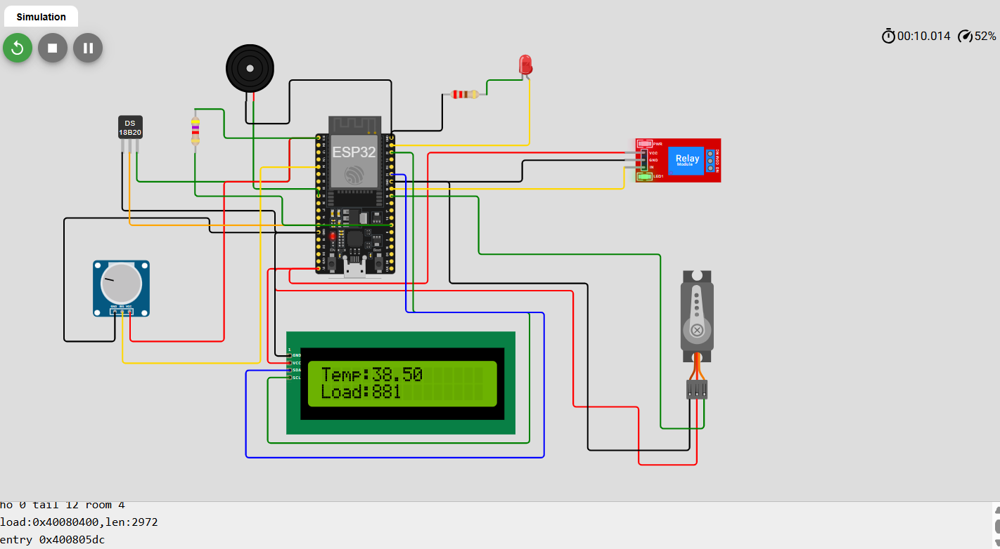

# 🚀 Industrial Smart Motor Protection System

An IoT-based **Smart Motor Protection and Monitoring System** built using ESP32.  
The system continuously monitors **motor temperature and load conditions** to prevent overheating and overload failures in industrial environments.

If abnormal conditions are detected, the system automatically **shuts down the motor** and alerts the user through **LED, buzzer, LCD display, and IoT notifications**.

---

## 📌 Project Overview

Electric motors are widely used in industries and are prone to damage due to **overload, overheating, and electrical faults**.  
This project provides a **smart monitoring system** that ensures motor safety by detecting abnormal conditions and taking immediate protective actions.

The system also allows **remote monitoring using IoT**, enabling users to check motor status from anywhere.

---

## ✨ Features

✔ Real-time temperature monitoring  
✔ Motor overload detection  
✔ Automatic motor shutdown using relay  
✔ LED and buzzer fault alerts  
✔ LCD display for live system status  
✔ IoT monitoring using Blynk  
✔ Remote motor control from smartphone  
✔ Simulation using Wokwi  

---

## 🧰 Components Used

- ESP32 Development Board  
- DS18B20 Temperature Sensor  
- Servo Motor (Motor Simulation)  
- Relay Module  
- 16x2 LCD Display (I2C)  
- LED Indicator  
- Buzzer  
- Potentiometer (Load Simulation)  
- 4.7kΩ Pull-up Resistor  
- 220Ω Resistor  
- Jumper Wires  

---

## 🛠 Software & Tools

- Arduino IDE  
- Wokwi Simulator  
- Blynk IoT Platform  
    

---

## ⚙ System Working

1. The **temperature sensor continuously monitors motor temperature**.
2. A **potentiometer simulates load conditions**.
3. The ESP32 processes sensor data and checks if values exceed safe limits.
4. If a fault occurs:
   - Motor is turned **OFF using relay**
   - **LED indicator** turns ON
   - **Buzzer alarm** activates
   - LCD shows **fault message**
   - IoT alert is sent to user's phone
5. Under normal conditions, the motor continues running safely.

---

## 🖼 Circuit Diagram

---

## 🖥 Simulation

🔗 Simulation Link  
https://wokwi.com/projects/457774938924033025

---

## 📹 Project Demonstration Video

Watch the working demonstration here:

🔗 Video Link  
https://youtube.com/

---

## 🔮 Future Improvements

- Real current sensor integration (ACS712)
- Industrial motor monitoring system
- Cloud data logging
- AI-based predictive maintenance
- GSM module for SMS alerts

---

## 👨‍💻 

Aman Kumar Gupta
B.Tech – Electronics and Communication Engineering  
University College of Engineering and Technology, Hazaribag (VBU)

